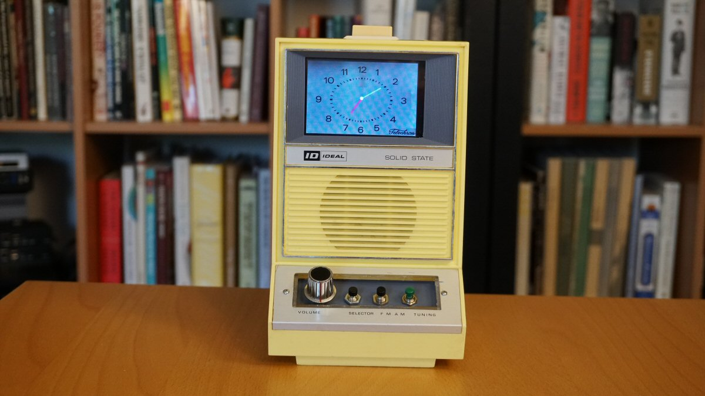

# ugly-alarm-clock
Turn an old clock radio into a modern marvel. Watch the video: https://youtu.be/4f58pf0taho



The demo device used [balenaCloud](www.balena.io) for ease of running containers remotely on a Pi, but this can be run with plain Docker as well.

**Note: This repo is for demonstration and inspiration purposes only. The software worked on my particular hardware setup which may be difficult to reproduce exactly. I can't guarantee this will work or be maintained, and unfortunately I likely can't respond to individual questions/issues...**

## Parts Used

- Crappy old alarm clock, the uglier the better
- TPA2016 Audio amp: https://www.adafruit.com/product/1712
- MAX4544 Analog Switch: https://www.adafruit.com/product/5892
- RDA5807 FM Radio module
- 3.5 inch LCD screen: https://www.adafruit.com/product/2441

## Software Used

- HTML 5 Slot Machine: https://github.com/johakr/html5-slot-machine
- balena Browser Block: https://github.com/balena-io-experimental/browser
- balenaCloud: https://www.balena.io
- RDA5807 code used from here: https://github.com/tinkeringtech/CircuitPython_rda5807

## Setup

The software runs in containers. You can use Docker on the Pi or balenaOS/balenaCloud.

### Docker
- Install Docker on your Pi
- Clone this repo to the Pi
- run `docker compose up -d`

### balenaCloud
- Create a free balenaCloud account
- Clone this repo to a dev machine and use the balenaCLI to push a release
- Download a provisioned OS from balenaCloud and flash your Pi


config.txt - overwrite SD card version with the below after flashing but before first provisioning.
```
hdmi_cvt=480 320 60 1 0 0 0
hdmi_force_hotplug=1
hdmi_group=2
hdmi_mode=87
avoid_warnings=1
disable_splash=1
dtoverlay=vc4-fkms-v3d
dtparam=i2c_arm=on
dtparam=spi=on
dtparam=audio=on
enable_uart=0
gpu_mem=256
```
Device variables:

FBCP_DISPLAY=adafruit-hx8357d-pitft

KIOSK=1

AUDIO_OUTPUT=RPI_HEADPHONES


Replace [slot.wav](https://github.com/alanb128/ugly-alarm-clock/blob/11fad284376526475cbbb9bac4f8eb3be42c2aab/controller/slot.wav) with an actual slot machine wav file (44.1/16 bit) since I can't include the one I used in this repo. (Check out [freesound.org](https://freesound.org/people/pierrecartoons1979/sounds/118236/?) or [mixcit.co](https://mixkit.co/free-sound-effects/slot-machine/).)

